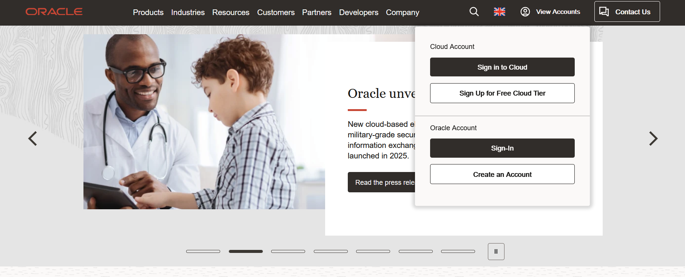

# free-oracle-minecraft-server

A guide on setting up a free 24/7 minecraft server.

This guide follows [this blog post](https://blogs.oracle.com/developers/post/how-to-set-up-and-run-a-really-powerful-free-minecraft-server-in-the-cloud) by Oracle, with a couple adjustments to make your life easier. The blog is [mirrored](./media/How To Set Up and Run a (Really Powerful) Free Minecraft Server in the Cloud.html) as in the past, the Oracle website has stopped working.  
Mirror Date: 2025-05-16

## Make A Free Oracle Account

The first thing you need to do to setup a free minecraft server is create an Oracle Free Tier account.

Follow the above guide for this. No changes made.

### Upgrade to a Paid Account (Recommended)

This step is optional but strongly recommended. It will make the [creating a virtual machine](README.md#creating-the-virtual-machine) step much simpler and it will be essentially instant.

Why are we doing this? Because for all basic free tier accounts, there's a limit on how many free-tier servers can exist. If you upgrade, then Oracle will consider you a paying customer, and let you make the instance instantly.

There are some prerequisites of this step.

- Access to a debit card from a bank account
- You have at least $100 or the equivalent in your local currency, in said bank account (you do not get charged)

It requires you to have the equivalent of $100 within a bank account, however the transaction is temporary and gets cancelled on Oracle's side once they confirm your account has enough money. This is a precautionary measure on Oracle's side to demonstrate that your account would be able to pay for any running costs. If you follow this guide and never surpass the free tier resources, you will never be charged.

Things to note:
The transaction WILL NOT deduct any money from your account when cancelled, but it will disappear with no record of it's existence.
As a premium account user, if you only use their free tier of resources and use them within the predefined limits, they won't actually charge you (unless something is configured incorrectly).

## Creating the Virtual Machine

Create a Virtual Machine with the settings seen in the blog post.
Not a lot of steps are changed at this point, because largely, it is the same process.
Once that is done, wait for it to load and then we can start to connect to it. This can take about 15 or so minutes however usually takes less time.

One recommendation to make here: create 2 or 4 servers, and split your allocated free tier resources (4 CPU cores and 24GB RAM on Free Tier Images) between them.
This is helpful in case you want to use said servers for another purpose, eg if you wanna use them to host a website. NOTE: Hosting additional services will require you to configure ports and security rules, and perform several of the following steps repeatedly.

## Connecting to a Virtual Machine

Recommended tools to use:

- putty (Windows) : SSH client, lets you communicate with the Oracle server

Commands to use:

- screen / tmux : allow you to run programs in the background (detached), and then look at later (reattaching)
- sh            : running bash scripts to automate actions
- wget / curl   : download content from the network, eg files on web servers

Optional

- crontab (optional)  : automate actions such as backups and the like

### Routers

- mcvcli              : simplifies the process of server creation, especially for MODRINTH modpacks
- manual              : manually running the commands and installing the server files
- docker              : simplifies process of server creation, through the use of

## Setting up a Server

The Oracle guide does have setup steps for actually starting the server, and you can follow them, however they are for primarily a Vanilla version of the game. As a result, you would end up having to look through long guides such as <https://minecraft.wiki/w/Tutorial:Setting_up_a_Java_Edition_server>.

Depending on what route you want to take, look into the following:

- [mcvcli](./options/mcvcli.md)
- [manual](./options/manual.md)
- [docker](./options/docker.md)

## After it is Set Up

Once you setup your server, there are a couple things to be aware of.
As such, please read the following: [post intall](/options/post-install.md)
