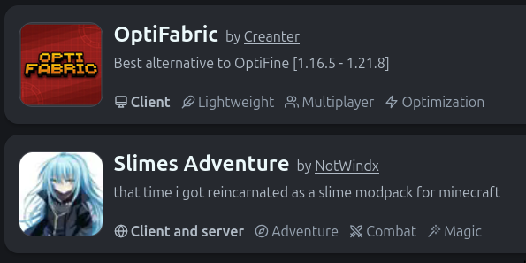

# MCVCLI

This is my recommended way to setup a minecraft server, as ultimately it is the simplest.
You install a command using rust, and then just run a couple commands. Very convenient to automate with shell scripts as well, since it is so simple if you so desire.

## Install MCVCLI

To be able to use the command `mcvcli`, you first need to install [Rust](https://www.rust-lang.org/learn/get-started).

Once Rust is installed, you should be able to use Cargo. If not, try running `rustup update`

And once you have rust installed, you can install `mcvcli` via running the following command:

```
cargo install mcvcli
```

Fairly simple stuff.
If you need an explanation of what which command does, you can add `-h` to any `mcvcli` command, and it will display all the possible options, the command structure, and more.

## Creating a server

To create a minecraft server, navigate to the directory you want to create the server in, and run:

```
mcvcli init
```

This will guide you through the setup. For the first time you are running this command, I recommend you to let it guide you.

Then, run:
`mcvcli start -de`

This will start the server in the background, and let you check on if it is running with `mcvcli status`.

If you want to run commands, you can then run `mcvcli attach`, where you will be able to run commands in the server such as:

- op [username]
- say [message to players]
- etc.

## What Now?

Now, I recommend reading [what to do after installing](./post-install.md).
Nothing else on this page is necessary, and you will likely learn if you experiment.
However, if you wish to learn more, read the following:

## Advanced mcvclI

Read the below if you so desire.

After you have made a server and ran it, there are a couple things that I would recommend.

First, run `mcvcli -h`. This will display all the possible subcommands you can display at this level.
Read through them, what I consider to be the most important ones are:

- start (-d -e)
- stop
- status
- backup

Most commands have the option of adding a subcommand `help`, however as the `mcvcli init` command instead would create a folder `help` if you tried that, I recommend using `-h`.

### Init

Options:

- -f, --file    : if you have a specific file to use as a server file, if not you can specify `install` or `modrinth`
- -t, --type    : modlauncher / type of server you want. EG Vanilla, Forge, Fabric, Spigot, or other. Based on <https://mcjars.app>
- -v, --version : a number, literally a Minecraft Release version number such as 1.21.7
- -b, --build   : a number, based on the numbers seen at <https://mcjars.app>
- -r, --ram     : MB of RAM to allocate to the server
- -j, --java    : Java version to use, haven't used it yet

Be aware, depending on what you choose between these, not all options will be cross compatible. EG if you choose `-f modrinth`, and then select a Fabric server modpack, and then have `-t  forge` as the type of server, it will be incompatible.

#### File

`install` just tells the program to install a jar file from the internet
`modrinth` tells `mcvcli` to install a jar file based on a modrinth modpack that has 'server'



NOTE: The relevant modpack must claim to be server compatible to show up in the Modrinth list.
Furthermore, if you do not find your modpack, you may select `search` in order to have the program search through the modrinth website, looking for servers to download

#### Build

This only really matters if doing a modded server, if doing a vanilla server, you will only have 1 build available to you. See below:


[fabric build options, many](./media/mcvcli/vanilla-builds.png)

### Install

Install is similar to [init](#init), however it has fewer options.
The options `install` doesn't have all the same

### Start

The main option:

- -d, --detached      : lets you run the server in the background, and go back to it later
- -e, --eula          : automatically accepts the eula, saving you one step when starting the server, and preventing you from needing to edit the server.properties file
- -t, --timeout [time]  : time the server waits to stop, in seconds

Note: I have not experienced a meaningful difference when using `-t`, so I am not sure what affect it has on the actual server.

### Stop

Safely stops the server, letting it save and kick players without corrupting the world.

The main option is `-t`, similar to `start`. Again, unsure what it does.

### Status

Tells the user if the server is running or not.
If the server is running, it also tells you important information such as:

- memory use
- time running
- start time

### Backup

This command can be used to create custom formatted backups,
list them, delete them, and restore the server to a backup
(ie rollback the server).
