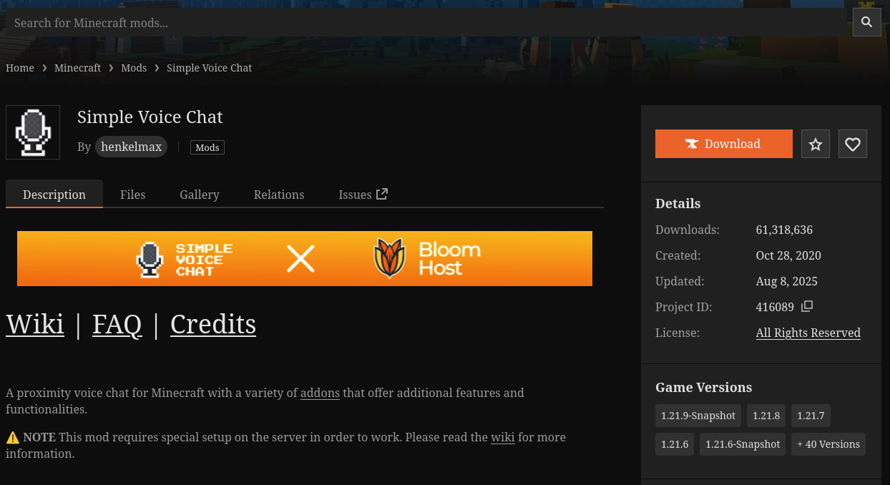
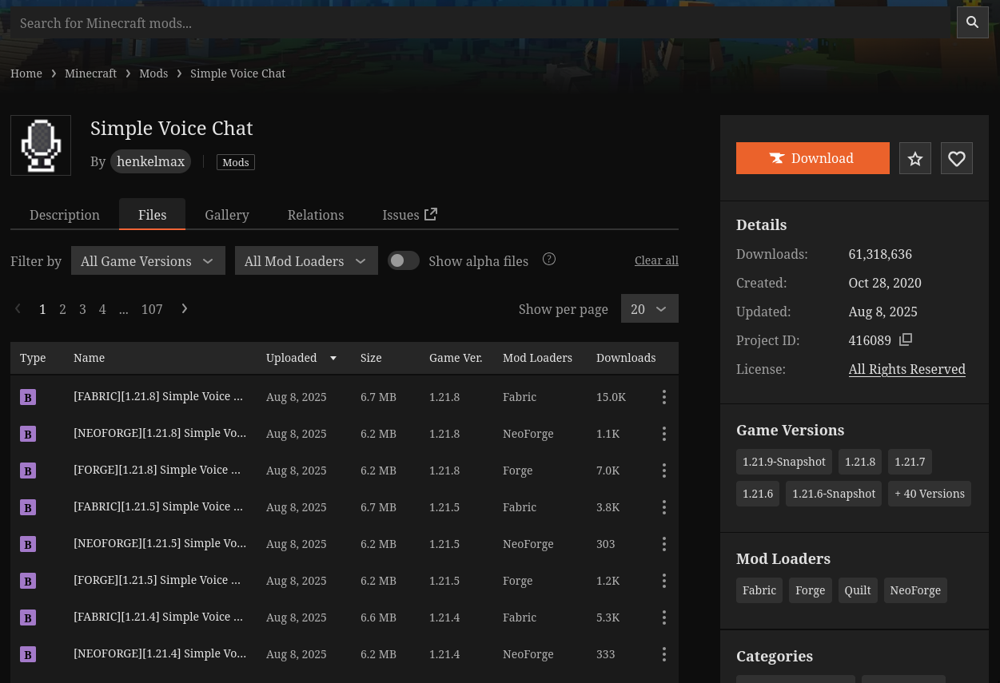
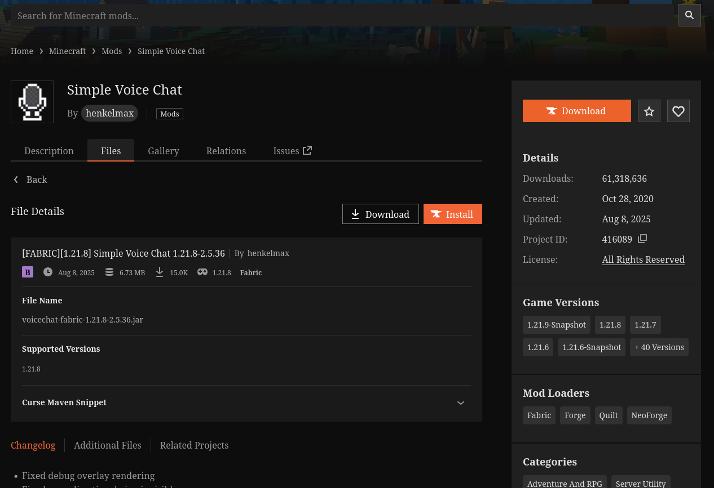
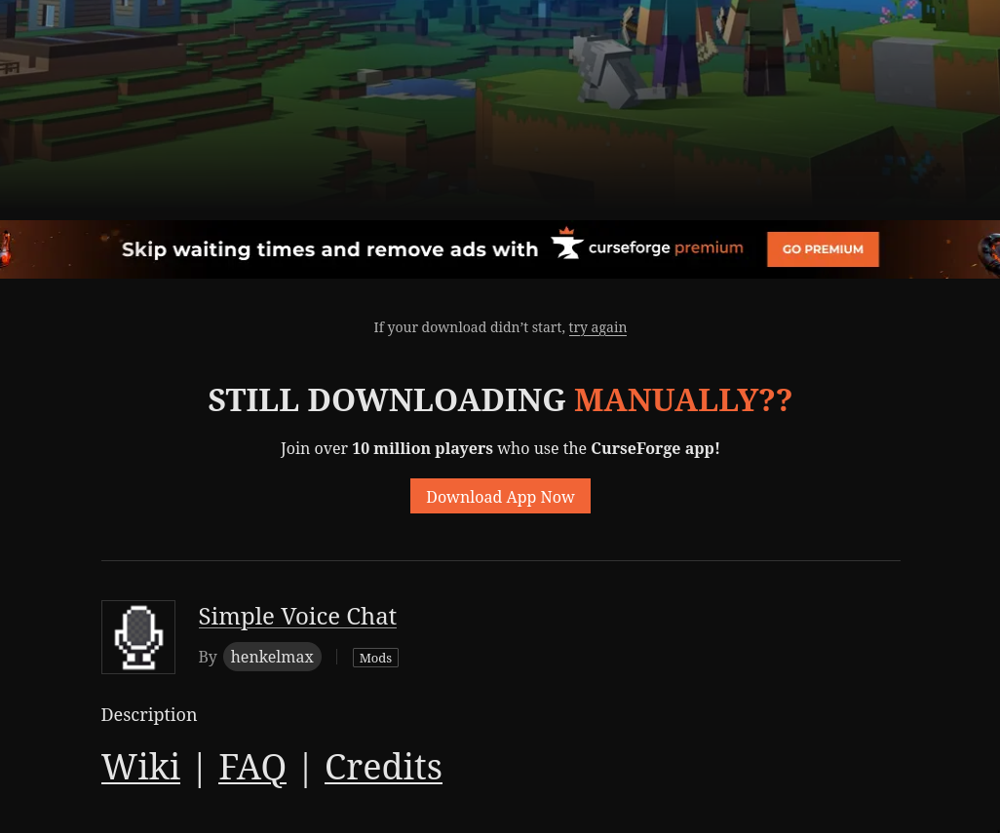
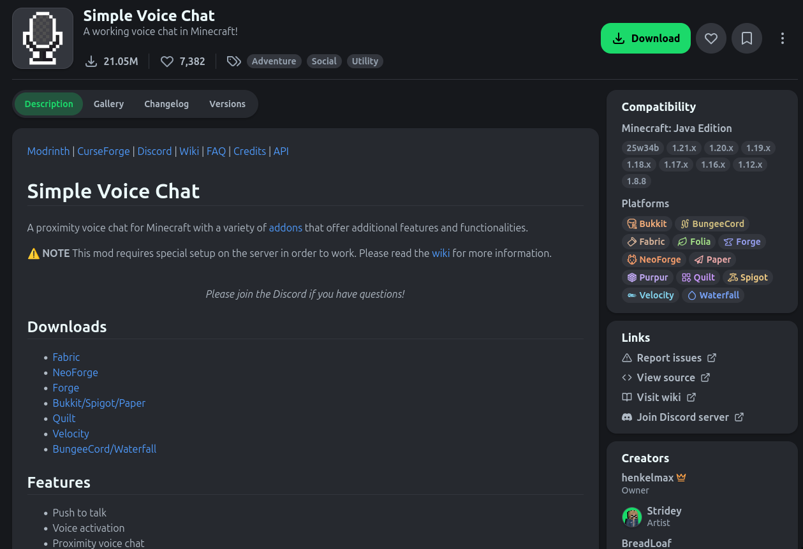
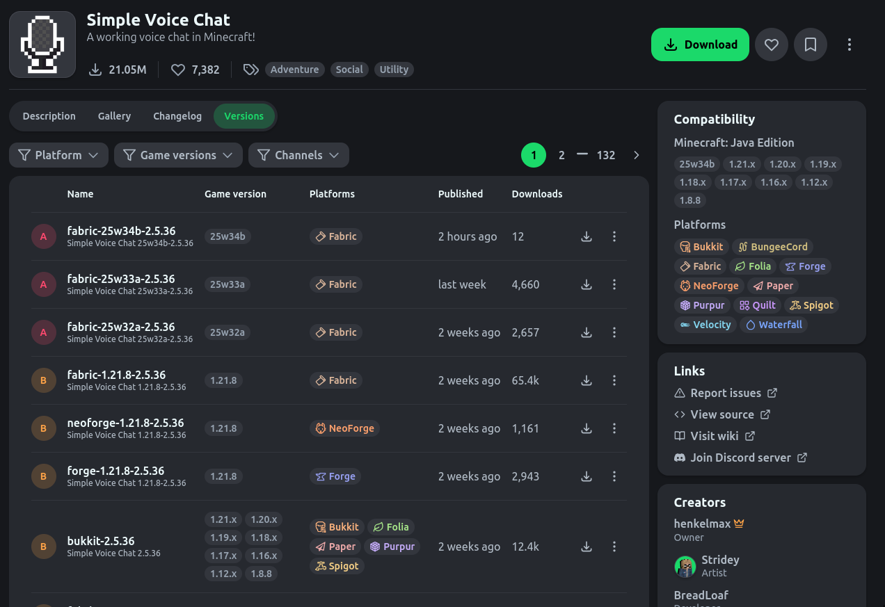

# How to set up a Modded Server

The various server types have their own instructions.

First you need to download the actual server from their websites,
and then optionally add any mods, modpacks, or plugins you want to add to the server.
You will likely have to unzip some resources after downloading them,
and to do so you may have to download a package to unarchive them.

- [Fabric](./fabric.md)
- [Forge](./forge.md)

## Downloading Relevant files from

### Curseforge

1. Go to the page of the modpack or mod you want to download. EG: Simple Voice Mod

2. Go to `Files`

3. Select the version you want to install, and click `Download`

4. Cancel the initial download, since we don't care about the actual download but rather the link to the resource.

5. Hover over `try again`

6. Right click and select `Copy Link`

### Modrinth

1. Go to the page of the mod or modpack you want to download. EG: Simple Voice Mod

2. Go to Versions

3. Hover over the download icon and right click, select copy link.

Download Icon:

